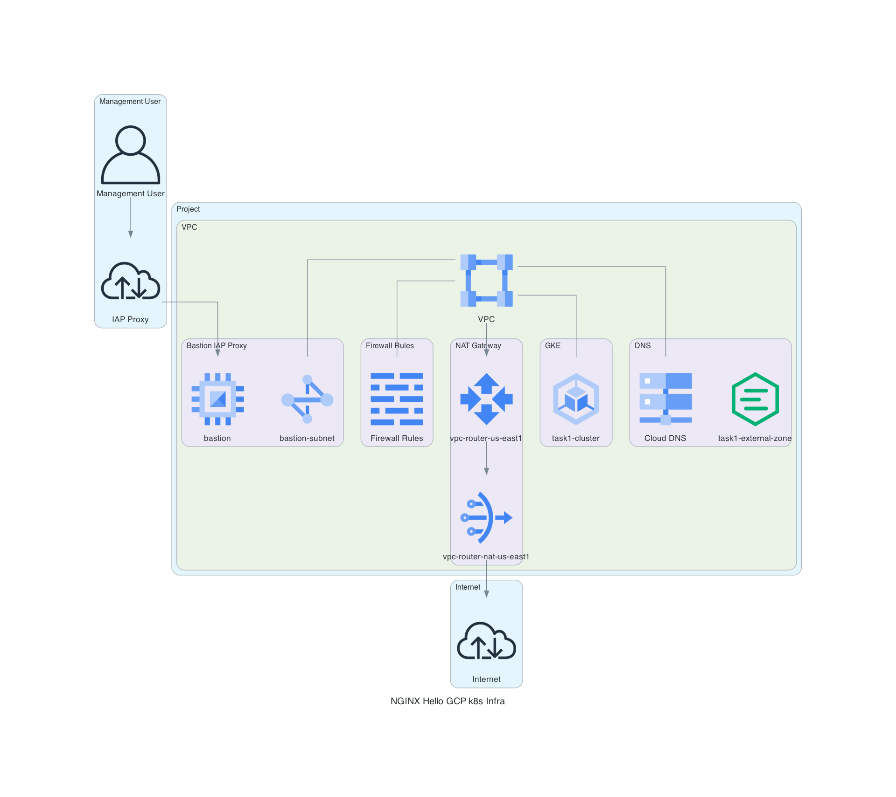

# NGINX Hello Demo Deploy to GKE

## About

This repo stores the terraform files necessary to deploy from zero the complete infrastructure in GCP using GKE to host the NGINX Hello application.

This app is live [clicking here](https://task1-app.mendanhafranco.com)

## Usage

Inside the ```terraform``` folder you will find 3 folders:

- hosting-infra
- application
- modules

The modules folder is where the Terraform modules used by the ```hosting-infra``` and ```aplication``` Terraform recipes are store, they are:

- [Bastion Host](terraform/modules/bastion-host/README.md)
- [Kubernetes Autopilot Cluster](terraform/modules/k8s-cluster/README.md)
- [Network Basic Infra](terraform/modules/network-basic-infra/README.md)

### Basic Hosting Infrastructure

In order to be able to deploy the NGINX container, is needed to run the [hosting-infra](terraform/hosting-infra/) recipe first, to provision the basic resources in GCP:



After applying this recipe in your GCP Project, will you have:

- A VPC network
- Firewall rules to allow egress web traffic (TCP/80 and TCP/443) from all instances within the VPC and ingress from the [GCP IAP](https://cloud.google.com/iap/docs/concepts-overview) service in order to allow the secure management to the created resources
- Subnets to be used by the GKE Cluster (with the secondary Pod and Services ranges), Bastion and a Global Proxy Only subnet needed to allow Proxy Load Balancers to reach their private backends
- A Spot VM configured with Ubuntu and TinyProxy to serve as a HTTPS Proxy to allow the GKE API access using the IAP tunnel like a Bastion. This recipe also creates a Service Account exclusive to this VM usage, without any privilege in GCP. (The recipe outputs the needed command to start the IAP Tunnel in the client machine.)
- A Cloud NAT attached to a Cloud Router to allow the VPC resources to access internet without the need to have a external IP attached to it
- A GKE Autopilot Cluster
- A managed public DNS Zone in Cloud DNS

### Application

After provisioning the basic needed infrastructure with the [hosting-infra](terraform/hosting-infra/) recipe, it's possible to set the ```HTTPS_PROXY``` in the client machine, and execute the [application](terraform/application/) deployment Terraform recipe. That will create the following:


In order to properly use the GKE Cluster as the hosting solution to the application and serve it to the clients, this Terraform recipe creates:

- A Namespace, where all the resources are created in the GKE Cluster
- A k8s service account with no privileges to be used by the application pods
- 3 Network Policies, 1 to deny any kind of ingress or egress traffic from the application pods, other to allow only the ingress from the GCP Load Balancer and last other one to allow the pod to communicate with the GCP Metadata Server to authenticate its Service Account, as [recommended by Google when using Workload Idenitity Federation](https://cloud.google.com/kubernetes-engine/docs/how-to/network-policy#network-policy-and-workload-identity) - Defaults in Autopilot clusters.
- An ingress resource to allow external traffic to the application with a Google Managed SSL Certified, and a Front-End Configuration to force the HTTPS Redirect when clients try to access the app using the HTTP endpoint.
- A Service to expose the Pods within the GKE Cluster
- A deployment that manages the ReplicaSet responsable for maintain the Application Pods replicas (3 by default)